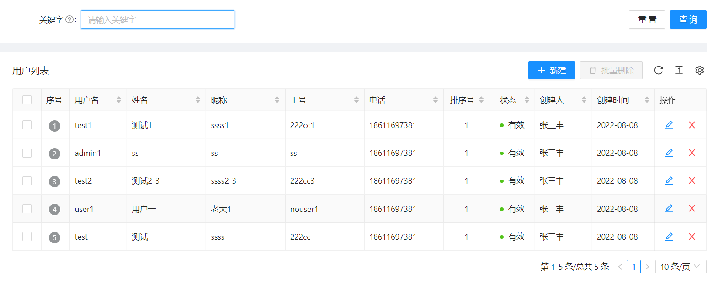
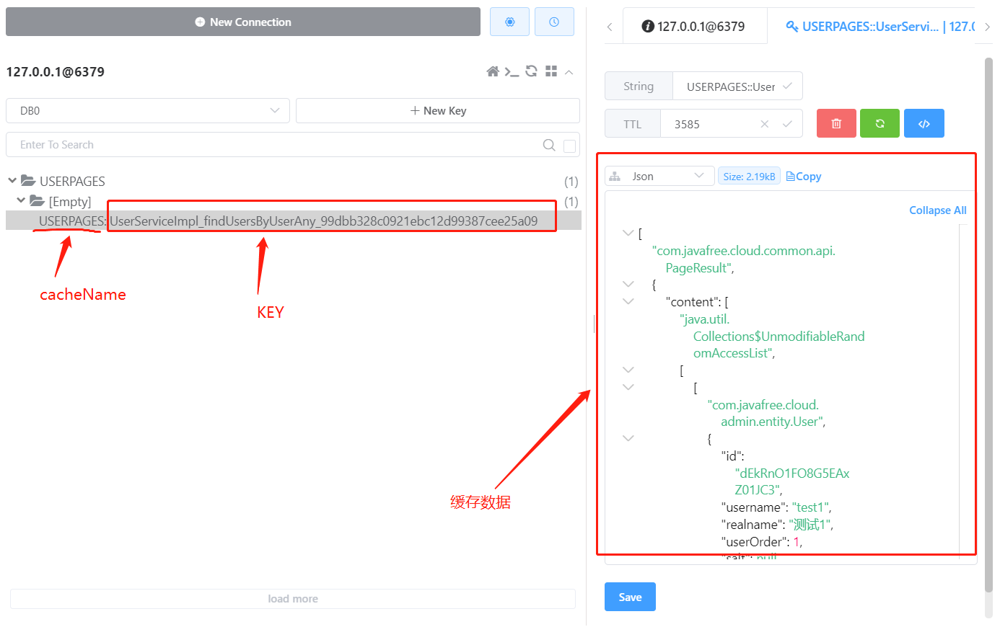

## 为什么需要多级缓存

​		Redis 作为常用缓存中间件，在我们的许多项目中广范围使用，目前大部分应用缓存都是基于 spring-boot-starter-cache 实现,基于注释（annotation）的缓存（cache）技术。虽然这种方式的确大大提升了系统的运行速度，但如果系统业务访问量巨大，对缓存依赖加大，调用Redis缓存的请求量也会急剧攀升，Redis服务压力会非常大，甚至Redis服务会成为系统的服务瓶颈。同时，在一般情况下，Redis服务与应用服务都是分机部署，两者之间频繁调用，也会带来网络 IO 的急剧增加。

​		应用spring-boot-starter-cache缓存默认功能，存在问题主要有：

-  默认仅支持单一的缓存中间件，如选择Redis、ehcache或caffeine等中的一种，并不能同时使用。
- 缓存过期配置：Spring Cache 不支持主动的过期策略
- 只有一级缓存功能。

​		由于以上原因，设计一种支持本地和远程的二级缓存功能，显得非常必要。设计需要考虑的因素：

- 一级缓存（本地）：选择一种基于Java的缓存库， 提升完整的缓存管理功能，经分析对比Caffeine是最适合的选择。本地缓存基于JVM空间有限，对缓存空间有要限制，服务重新启动，缓存数据会消失。

- 二级缓存（远程）：Redis是一高性能、高可用的key-value数据库，支持多种数据类型，支持集群，和应用服务器分开部署易于横向扩展。重启应用服务器缓存数据不会丢失；Redis是集中式缓存，不存在不同应用服务器之间同步数据的问题。

- 数据一致性：一级缓存和二级缓存，需要设计一种有效的方式，保证缓存数据一致性问题。考虑基于消息机制，保证不同缓存层的数据一致性，采用Redis的pub/sub机制，做为同步消息服务。

-  服务熔断：应用缓存依赖远程Redis服务，如果Redis服务出现故障，需要保证缓存服务的正常运行。因此需要服务熔断机制，这里采用Resilience4j 做为熔断器。

  

## 如何使用

### 1、集成Spring Boot

#### 1.1 引入依赖

```xml
  <dependency>
            <groupId>com.javafree.cloud.cache</groupId>
            <artifactId>javafree-cloud-cache-spring-boot-starter</artifactId>
            <version>1.0.6</version>
  </dependency>
```

#### 1.2 开启缓存支持

​		在入口类增加@EnableCaching 注解

 ```java
 @EnableCaching
 public class App {
 	public static void main(String[] args) {
 		SpringApplication.run(App.class, args);
 	}
 }
 ```

#### 1.3 增加配置

​		在工程的application.yml中，加入缓存配置信息

```yaml
spring:
  # redis 相关配置
  redis:
    # 连接超时时间（毫秒）
    timeout: 1200
    # Redis数据库索引（默认为0）
    database: 0
    # Redis服务器地址 ${HOST:localhost}
    host: 127.0.0.1
    # Redis服务器连接端口
    port: 6379
    # Redis服务器连接密码（默认为空）
    password: 123456
    ssl: false
    #lettuce 连接池配置，基于netty nio 如果让lettuce池生效需要引入 commons-pool2
    lettuce:
      pool:
        # 连接池最大连接数（使用负值表示没有限制）
        max-active: 8
        # 连接池中的最大空闲连接
        max-idle: 8
        # 连接池中的最小空闲连接
        min-idle: 0
        # 连接池最大阻塞等待时间（使用负值表示没有限制）,缺省值-1
        max-wait: 30s

  # spring boot cache  相关配置
  cache:
    type: redis

    # Javafree Multilevel 二级缓存工具包参数配置
    multilevel:
      #  Redis缓存时间配置
      time-to-live: 1h
      #缓存key是否加前缀.
      use-key-prefix: false
      #缓存key的前缀 当use-key-prefix为true时有效
      key-prefix: "javafreekey:"
      # 缓存更新时通知其他节点的 redis消息主题名称
      topic: "cache:multilevel:topic"
      #是否存储空值，默认true，防止缓存穿透
      allow-null-values: true
      # 本地 Caffeine缓存配置
      local:
        #最大缓存对象个数，超过此数量时之前放入的缓存将失效
        max-size: 2000
        #  初始的缓存空间大小
        initial-capacity : 1000
        #caffein缓存过期算法配置
        #缓存失效模式 有WRITE、ACCESS和RANDOM三种，默认RANDOM
        # RANDOM 对象expireAfter 允许复杂的表达式，过期时间可以通过自定义的随机算法获得
        # ACCESS对应expireAfterAccess 表示上次读写超过一定时间后过期，
        # WRITE对应expireAfterWrite 表示上次创建或更新超过一定时间后过期
        expire-mode: RANDOM
        #最后一次写入或访问后经过固定时间过期，对应ACCESS
        expire-after-access: 1800s
        # 最后一次写入后经过固定时间过期，对应WRITE
        expire-after-write: 1800s
        #本地缓存条目过期的时间偏差百分比，对应RANDOM
        expiry-jitter: 50
      # Redis异常处理，Resilience4j 断路器配置
      circuit-breaker:
        # 禁止进一步调用 Redis 的调用失败百分比
        failure-rate-threshold: 25
        # 禁止进一步调用 Redis 的慢速调用百分比
        slow-call-rate-threshold: 25
        #定义 Redis 调用被认为是慢的持续时间  单位毫秒
        slow-call-duration-threshold: 250ms
        # 用于连通性分析的滑动窗口类型 两种，基于时间（time_based）和记数的（count_based）
        sliding-window-type: count_based
        #用于测试断路器关闭时后端是否响应的 Redis 调用量
        permitted-number-of-calls-in-half-open-state: 20
        #在关闭断路器之前等待的时间量，
        max-wait-duration-in-half-open-state: 5s
        # Redis调用分析的滑动窗口大小（调用/秒）
        sliding-window-size: 40
        #在计算错误或慢速调用率之前所需的最小调用次数
        minimum-number-of-calls: 10
        #在允许 Redis 调用测试后端连接之前需要等待时间。
        wait-duration-in-open-state: 2500ms

```

**注意：**采用nacos为配置中心时，遇到一个问题，如果把上面的内容全部放到nacos配置中心，redis lettuce连接池初始失败，导致缓存无法使用。需要将redis的配置信息放在工程的bootstrap.yml中，其他配置才生效。

- 工程中bootstrap.yml配置内容：

```json
#bootstrap.yml
spring:
  application:
    name: javafree-cloud-admin
  cloud:
    nacos:
#      discovery:
#        server-addr: 127.0.0.1:8848
      config:
        server-addr: 127.0.0.1:8848 #nacos中心地址
        file-extension: yml # 配置文件格式
        group: dev #指定分组
        namespace: dev #指定命名空间

  profiles:
    active: dev #指定环境类型 (dev：开发，prod：生产，uat:用户验证，test:测试) 分别对应application-{环境类型}.yml文件
  # redis 相关配置
  redis:
    # 连接超时时间（毫秒）
    timeout: 1200
    # Redis数据库索引（默认为0）
    database: 0
    # Redis服务器地址 ${HOST:localhost}
    host: 127.0.0.1
    # Redis服务器连接端口
    port: 6379
    # Redis服务器连接密码（默认为空）
    password: 123456
    ssl: false
    #lettuce 连接池配置，基于netty nio 如果让lettuce池生效需要引入 commons-pool2
    lettuce:
      pool:
        # 连接池最大连接数（使用负值表示没有限制）
        max-active: 8
        # 连接池中的最大空闲连接
        max-idle: 8
        # 连接池中的最小空闲连接
        min-idle: 0
        # 连接池最大阻塞等待时间（使用负值表示没有限制）,缺省值-1
        max-wait: 30s
  cache:
    type: redis

management:
  endpoints:
    web:
      exposure:
        include: "*"
debug: true
```

- nacos中yml配置内容：

```json
spirng:
 
  cache:    
    # JavafreeMultilevel 二级缓存工具包参数配置
    multilevel:
      #  Redis缓存时间配置
      time-to-live: 1h
      #缓存key是否加前缀.
      use-key-prefix: true
      #缓存key的前缀 当use-key-prefix为true时有效
      key-prefix: "javafreekey:"
      # 缓存更新时通知其他节点的 redis消息主题名称
      topic: "cache:multilevel:topic"
      #是否存储空值，默认true，防止缓存穿透
      allow-null-values: true
      # 本地 Caffeine缓存配置
      local:
        #最大缓存对象个数，超过此数量时之前放入的缓存将失效
        max-size: 2000
        #  初始的缓存空间大小
        initial-capacity : 1000
        #caffein缓存过期算法配置
        #缓存失效模式 有WRITE、ACCESS和RANDOM三种，默认RANDOM
        # RANDOM 对象expireAfter 允许复杂的表达式，过期时间可以通过自定义的随机算法获得
        # ACCESS对应expireAfterAccess 表示上次读写超过一定时间后过期，
        # WRITE对应expireAfterWrite 表示上次创建或更新超过一定时间后过期
        expire-mode: RANDOM
        #最后一次写入或访问后经过固定时间过期，对应ACCESS
        expire-after-access: 1800s
        # 最后一次写入后经过固定时间过期，对应WRITE
        expire-after-write: 1800s
        #本地缓存条目过期的时间偏差百分比，对应RANDOM
        expiry-jitter: 50
      # Redis异常处理，Resilience4j 断路器配置
      circuit-breaker:
        # 禁止进一步调用 Redis 的调用失败百分比
        failure-rate-threshold: 25
        # 禁止进一步调用 Redis 的慢速调用百分比
        slow-call-rate-threshold: 25
        #定义 Redis 调用被认为是慢的持续时间  单位毫秒
        slow-call-duration-threshold: 250ms
        # 用于连通性分析的滑动窗口类型 两种，基于时间（time_based）和记数的（count_based）
        sliding-window-type: count_based
        #用于测试断路器关闭时后端是否响应的 Redis 调用量
        permitted-number-of-calls-in-half-open-state: 20
        #在关闭断路器之前等待的时间量，
        max-wait-duration-in-half-open-state: 5s
        # Redis调用分析的滑动窗口大小（调用/秒）
        sliding-window-size: 40
        #在计算错误或慢速调用率之前所需的最小调用次数
        minimum-number-of-calls: 10
        #在允许 Redis 调用测试后端连接之前需要等待时间。
        wait-duration-in-open-state: 2500ms


```


### 2、使用注解

​		  使用Spring Boot Cache的注解，只要在需要缓存的方法上加上**@Cacheable/@CachePut/@CacheEvict** 注解即可，关于Spring Boot Cache注解的详细使用，请参考其他相关文档。

#### 2.1 缓存@Cacheable

​		`@Cacheable`注解会先查询是否已经有缓存，有会使用缓存，没有则会执行方法并缓存。

```java
 @Cacheable(value = "USERS",key ="#id" )
    public User getUserById(String id) {
        return userDao.findById(id).orElse(null);
    }
```

 **@Cacheable参数说明：**

- value：缓存空间的名称，必须指定至少一个 例如： @Cacheable(value=”mycache”) 或者 @Cacheable(value={”cache1”,”cache2”}

- key：
  - 1.当我们要使用root对象的属性作为key时我们也可以将“#root”省略，因为Spring默认使用的就是root对象的属性。 	
    - @Cacheable(key = "targetClass + methodName +#p0")
  - 2.使用方法参数时我们可以直接使用“#参数名”或者“#p参数index”。
    -  @Cacheable(value="users", key="#id")
    -  @Cacheable(value="users", key="#p0")

- condition：缓存的条件，可以为空，使用 SpEL 编写，返回 true 或者 false，只有为 true 才进行缓存/清除缓存
  - 例如：@Cacheable(value=”testcache”,condition=”#userName.length()>2”)
- unless：否定缓存。当条件结果为TRUE时，就不会缓存。例如：
  - @Cacheable(value=”testcache”,unless=”#userName.length()>2”)

#### 2.2 更新@CachePut

​		@CachePut注解作用，是根据方法的请求参数对其结果进行缓存，与 @Cacheable 不同的是，它每次都会触发真实方法的调用 。简单来说就是用户更新缓存数据。但需要注意的是该注解的value 和 key 必须与要更新的缓存相同，也就是与@Cacheable 相同。

```java
 @CachePut(value = "USERS",key ="#user.id" )
    public User updateUserById(User user) {
        return userDao.save(user);
    }
```

#### 2.3 清除@CacheEvict

​		使用 @CacheEvict 注释，可以用来删除一个、多个或所有的缓存值，以便可以再次将新值加载到缓存中：

```java
 @Cacheable(value = "USERS",key = "#p0.id")
    public User save(User user) {
        userDao.save(user);
        return user;
    }

    //清除一条缓存，key为要清空的数据
    @CacheEvict(value="USERS",key="#id")
    public void delect(String id) {
        userDao.deleteAllById(id);
    }

    //方法调用后清空所有缓存
    @CacheEvict(value="USERS",allEntries=true)
    public void delectAll() {
        userDao.deleteAll();
    }

    //方法调用前清空所有缓存
    @CacheEvict(value="USERS",beforeInvocation=true)
    public void delectAll() {
        userDao.deleteAll();
    }
```

**@CacheEvict参数说明：**

- allEntries：是否清空所有缓存内容，缺省为 false，如果指定为 true，则方法调用后将立即清空所有缓存，示例：
  - @CachEvict(value=”cachename”,allEntries=true)
- beforeInvocation：是否在方法执行前就清空，缺省为 false，如果指定为 true，则在方法还没有执行的时候就清空缓存，缺省情况下，如果方法执行抛出异常，则不会清空缓存，示例：
  - @CachEvict(value=”cachename”，beforeInvocation=true)

#### 2.4 组合@Caching

​		有时候我们可能需要组合多个Cache注解的使用，此时就需要@Caching来组合多个注解标签了。如下面的代码片段所示，我们可以用@Caching 将多个缓存注解分组，并用它来实现我们自己定制的缓存逻辑。

```java
   @Caching(cacheable = {
            //将对象缓存
            @Cacheable(value = "USERS", key = "#p0.id", condition = "#p0.id!=null&& #p0.id.length()>0")
            },
            put = {
                    //如果用户有id，是更新操作
                @CachePut(value = "USERS", key = "#user.id", unless = "#user.id==null||#user.id.length()<1")
            },
            evict = {
            //用户列表记录有更新或增加，则清除用户页缓存
                    @CacheEvict(value ="USERPAGES", allEntries=true)
            })
    public User saveUser(User user) {
    。。。。。
    }
```

上面代码实现的逻辑是：

- 当新增操作时，用户ID不为空时，则缓存数据。
- 当更新操作时，用户ID不为空时，则更新对应key缓存数据。
- 当有user对象新增或修改时，则清除用于保存user对象列表的“USERPAGES”缓存空间。

#### 2.5 多条件分页列表缓存

​		在应用开发中，如何支持多个属性查询条件，并且对查询结果进行分页的缓存技术方案，一直是一个比较难于解决的问题。主要有以下几方面原因：

- 多条件分页查询，用什么key对结果进行缓存，才能让同样的条件查询命中已有缓存，这个问题需要解决。
- 多条件分页查询，同样的查询条件，还需要支持不同字段的升降序排序，支持不同页码的分页列表，这些条件都要与key的匹配相关.

##### 		查询参数格式设计：		

​		为了统一多条件查询的参数格式，我们设计了统一查询参数对象，对象结构示例如下：

```json
{
  "dataParam": {
    "id": "string",
    "username": "string",
    "realname": "string",
    "userOrder": 0,
    "salt": "string",
    "avatar": "string",
    "sex": 0,
    "email": "string",
    "phone": "string",
    "status": 0,
    "workNo": "string",
    "createBy": "string",
    "createTime": "2022-08-08T07:56:04.447Z",
    "updateBy": "string",
    "updateTime": "2022-08-08T07:56:04.447Z",
    "userType": 0,
    "extData": "string",
    "nickname": "string"
  },
  "pageParam": {
    "currentPage": 0,
    "pageSize": 0,
    "sorts": [
      {
        "property": "string",
        "direction": "string"
      }
    ]
  }
}
```

​	**说明：**

​	参数对象结构，主要分为以下部分：

​	"dataParam"：查询条件字段值区域，用于传输字段及字段对应的值。

​	"pageParam"：查询分页参数值区域，用于传输列表的分页信息，包括"currentPage"当前页码，"pageSize“每页记录数。

​	"sorts"：查询排序字段值区域，是一个包括多个排序对象的数组。每个排序对象包括"property"排序字段名称，"direction"排充方式（类型有降序或升序:desc/asc）

​	 **查询参数示例：**

```json
{
  "dataParam": { 
    "username": "test",
    "realname": "测试" 
  },
  "pageParam": {
    "currentPage": 1,
    "pageSize": 10,
    "sorts": [
      {
        "property": "userOrder",
        "direction": "asc"
      },
     {
        "property": "nickname",
        "direction": "desc"
      }
    ]
  }
}
```

##### 	缓存注解写法：

​		为了满足多条件分页查询的缓存，我们自己实现了Spring cache KeyGenerator，用于生成缓存key。生成规则是：

```java
target.getClass().getSimpleName() + "_"
        + method.getName() + "_"
        + StringMD5(arrayToString(params, "_")
```

​	上面key生成的代码逻辑是：取目标类的**类名**+“下划线”+**方法名**+“下划线”+(**方法所有参数对象**转为JSON字符串后，再取字符串的指纹码)

```java
    @Cacheable(value ="USERPAGES", keyGenerator = "customKeyGenerator")
    public PageResult<User> findUsersByUserAny(User user, PageParam pageParam) {
        ......
    }
```

	#####  应用示例：

- 传入参数为:

```json
{"dataParam":{},
 "pageParam":{
     "currentPage":1,
     "pageSize":10,
     "sorts":[
         {"property":"userOrder",
          "direction":"ascend"
         }
     ]
 }
}
```

- 页面数据的效果：



- 数据在Redis中：




-  Service层的完整代码：

```java
package com.javafree.cloud.admin.service.impl;

/*
 * @Description: 用户对象service实现类
 * @Author gwz  gwz126@126.com
 * @Date 2021/8/26 17:40
 * @version V1.0
 */
import com.javafree.cloud.admin.dao.UserDao;
import com.javafree.cloud.admin.entity.User;
import com.javafree.cloud.admin.service.UserService;
import com.javafree.cloud.common.api.PageParam;
import com.javafree.cloud.common.api.PageParamUtils;
import com.javafree.cloud.common.api.PageResult;
import com.javafree.cloud.common.utils.JavaFreeBeanUtils;
import com.javafree.cloud.common.utils.PasswordUtils;
import org.springframework.beans.BeanUtils;
import org.springframework.beans.factory.annotation.Autowired;
import org.springframework.cache.annotation.CacheEvict;
import org.springframework.cache.annotation.CachePut;
import org.springframework.cache.annotation.Cacheable;
import org.springframework.cache.annotation.Caching;
import org.springframework.data.domain.Example;
import org.springframework.data.domain.ExampleMatcher;
import org.springframework.data.domain.Pageable;
import org.springframework.data.jpa.repository.Modifying;
import org.springframework.stereotype.Service;
import org.springframework.transaction.annotation.Transactional;
import org.springframework.util.Assert;
import org.springframework.util.StringUtils;

import java.util.List;

@Service
public class UserServiceImpl implements UserService {
    /**  缓存空间命名 */
    //用于保存单个对象的缓存空间名称
    private static final String CACHE_KEY_USERS ="USERS";
    //用于保存分页查询列表对象的缓存空间名称
    private static final String CACHE_KEY_USERPAGES ="USERPAGES";

    @Autowired
    UserDao userDao;
    
	/**
     * 通过用户ids，批量删除用户对象 
     */
    @Override
    @CacheEvict(value={CACHE_KEY_USERS,CACHE_KEY_USERPAGES},allEntries=true)
    public void deleteUserByIds(List<String> ids) {
        userDao.deleteUserByIds(ids);
    }
    
	/**
     * 通过用户id，删除用户对象 
     */
    @Override
    @CacheEvict(value = CACHE_KEY_USERS, key = "#id")
    public void deleteUser(String id) {
        userDao.deleteUserById(id);
    }
    
   /**
     * 通过用户id，获得用户对象 
     */
    @Override
    @Cacheable(value = CACHE_KEY_USERS, key = "#id")
    public User getUserById(String id) {
        return userDao.findById(id).orElse(null);
    }
 
    /**
     * 通过用户对象为条件返回用户分页列表数据,条件关系为and 
     */
    @Override
    @Cacheable(value =CACHE_KEY_USERPAGES, keyGenerator = "customKeyGenerator")
    public PageResult<User> findUsersByUser(User user, PageParam pageParam) {
        //通过pageparam 返回Pageable
        Pageable pageable = PageParamUtils.packagePageable(pageParam);
        //条件间的关系是and
        ExampleMatcher matcher = ExampleMatcher.matching()
                //全部模糊查询，即%{username}%
                .withMatcher("username", ExampleMatcher.GenericPropertyMatchers.contains())
                .withMatcher("realname", ExampleMatcher.GenericPropertyMatchers.contains())
                //忽略为空值字段
                .withIgnoreNullValues()
                // 忽略字段，即不管password是什么值都不加入查询条件
                .withIgnorePaths("password");
        Example<User> example = Example.of(user, matcher);
        return PageResult.of(userDao.findAll(example, pageable));
    }

    /**
     * 通过用户对象为条件返回用户分页列表数据,条件关系为or 
     */
    @Override
    @Cacheable(value =CACHE_KEY_USERPAGES, keyGenerator = "customKeyGenerator")
    public PageResult<User> findUsersByUserAny(User user, PageParam pageParam) {
        //通过pageparam 返回Pageable
        Pageable pageable = PageParamUtils.packagePageable(pageParam);
        //条件间的关系是or
        ExampleMatcher matcher = ExampleMatcher.matchingAny()
                //忽略为空值字段
                .withIgnoreNullValues()
                //全部模糊查询，即%{Username}%
                .withMatcher("username", ExampleMatcher.GenericPropertyMatchers.contains())
                .withMatcher("realname", ExampleMatcher.GenericPropertyMatchers.contains())
                .withMatcher("workNo", ExampleMatcher.GenericPropertyMatchers.contains())
                .withMatcher("phone", ExampleMatcher.GenericPropertyMatchers.contains())
                // 忽略字段，即不管password是什么值都不加入查询条件
                .withIgnorePaths("password");
        Example<User> example = Example.of(user, matcher);
        return PageResult.of(userDao.findAll(example, pageable));
    }

 /**
  * 新增和更新user
  */
  @Transactional
  @Modifying
  @Caching(
   cacheable = {
  //将对象缓存
        @Cacheable(value = CACHE_KEY_USERS, key = "#p0.id", condition = "#p0.id!=null&&#p0.id.length()>0")
   },
   put = {
        //如果用户有id，是更新操作
        @CachePut(value = CACHE_KEY_USERS, key = "#user.id", unless = "#user.id==null||#user.id.length()<1")
   },
   evict = {
        //用户列表记录有更新或增加，则清除用户页缓存
        @CacheEvict(value =CACHE_KEY_USERPAGES, allEntries=true)
   })
   public User saveUser(User user) {
        Assert.notNull(user, "User 对象不能为空.");
        if (StringUtils.hasText(user.getPassword())) {
            //如果页面传的密码不为空，则要进行加密后保存
            String encryption = PasswordUtils.encryption(user.getPassword());
            user.setPassword(encryption);
        }
        //有ID为修改
        if (StringUtils.hasText(user.getId())) {
            User tempUser = userDao.findById(user.getId()).orElse(null);
            Assert.notNull(tempUser, "User ID：" + user.getId() + " 数据库中没有找到.");
            //将传入的User对象值copy到tempUser对象中，并忽略User对象为空的属性
            BeanUtils.copyProperties(user, tempUser, JavaFreeBeanUtils.getNullPropertyNames(user));
            return userDao.save(tempUser);
        } else {
            //新增时判断是否已经有用户
            Assert.isNull(userDao.getUserByName(user.getUsername()), "保存失败，该用户名已存在！");
        }
       return userDao.save(user);
    }
 
}

```
##### 工程打包
  - 在工程目录下执行：
```shell
mvn install -Dmaven.test.skip=true
```
  - jar包安装到本地maven仓库
```shell
mvn install:install-file -Dfile=D:\working\javafree2022\javafree-cloud-cache-spring-boot-starter\target\javafree-cloud-cache-spring-boot-starter-1.0.6.jar -DgroupId=org.apache.lucene -DartifactId=lucene-core -Dversion=7.7.1 -Dpackaging=jar
```
